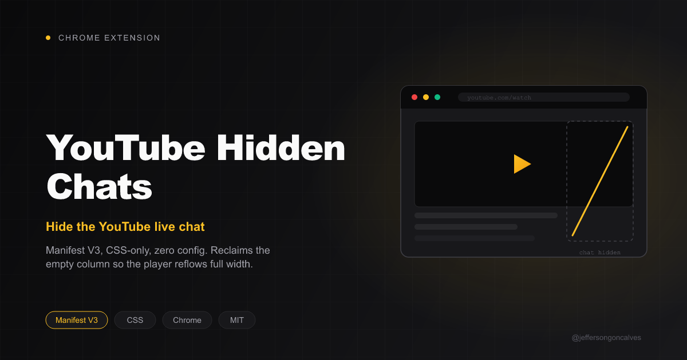

# YouTube Hidden Chats

A Chrome extension (Manifest V3) that hides YouTube's live chat by default, with a
per-channel exception list.

## How it works

`hide.css` is injected at `document_start` and hides the chat (`ytd-live-chat-frame`), its
empty container, and the "Live chat" card in the metadata — except when the current channel
is on the exception list.

`content.js` identifies the channel of the current page (via `link[itemprop="channelId"]`),
checks the saved exception in `chrome.storage.sync`, and applies the `yhc-show-chat` class on
`<html>` when the chat should stay visible. It reacts to YouTube's SPA navigation
(`yt-navigate-finish`) and to live storage changes.

Clicking the extension icon opens the management page (`options.html`), where you can list
channels already visited, add a channel manually (URL, `@handle`, or `UC...` ID), and toggle
"Show chat" per channel.

## Install (unpacked)

1. Open `chrome://extensions`
2. Enable **Developer mode** (top right)
3. Click **Load unpacked**
4. Select this folder

## Files

| File | Purpose |
|---|---|
| `manifest.json` | MV3 config |
| `hide.css` | Hides the chat by default and adjusts the layout |
| `content.js` | Detects the channel and applies/removes the exception |
| `background.js` | Opens the options page on icon click |
| `options.html` / `options.js` | Channel management page |
| `icons/` | 16/48/128 icons |

## License

MIT
